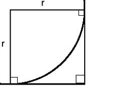
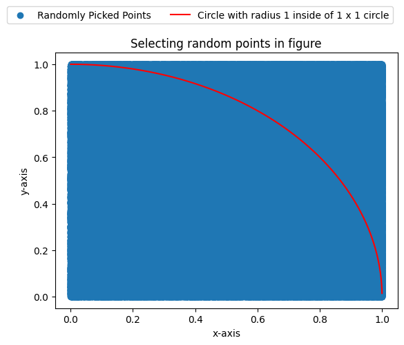

<h1 align="center">Finding Pi value by Counting</h1>

<h2>Introduction</h2>

Basically Pi is known as a float number which is irrational.
Most of the natural phenomena is containing calculation with Pi. This number is not just a thing in maths but also it's combined with our real worlds function like Golden Ratio.

<h2>Ideology</h2>

We all know that Pi is the constant we used for defining circular thing like area of circle, circumstance of a circle, volume of a sphere, surface area of a sphere, volume of cylinder, surface are of cylinder ant etc.

So, If we want to find the value of Pi by a manual method like counting we have to integrate of those geometry function with a manual tool like counting. For that purpose I select the tool Probability function.

<h2> How to use Probability here. </h2>

We can define probability of an event as,
$$\text{Probability of an event}=\frac{\text{count of that event happen}}{\text{count of total possible event}}$$ 

so lets take a quarter circle with radius r which is placed inside of a square with length of a side is r.

If we pick a point inside this square that point may be inside the quarter circle.We can randomly choose large amount of point inside the square but part of the whole points will fall inside that quarter circle. Now if we think about the probability of the point fall inside the circle can be defined as,
$$\text{Probability for the point fall inside the quarter circle}=\frac{\text{count of the points inside the circle}}{\text{count of the total point we picked inside the square}}$$

lets take,
$$P=\text{Probability for the point fall inside the quarter circle}$$ 
$$C=\text{count of the points inside the circle}$$ 
$$S=\text{count of the total point we picked inside the square}$$ 

Therefore,

$$P=\frac{C}{S}$$

When the total points we selected become ultimately large they approximate the value of the area of the square. Likewise points inside the quarter circle become the area of that.

Therefore we can tell the above probability function as,

$$P=\frac{\text{Area of the Quarter Circle}}{\text{Area of that square}}$$

But we know that,
$$\text{Area of the Quarter Circle}={\sfrac{1}{4}}\times\pi\times r^2$$
$$\text{Area of that square}=r^2$$

